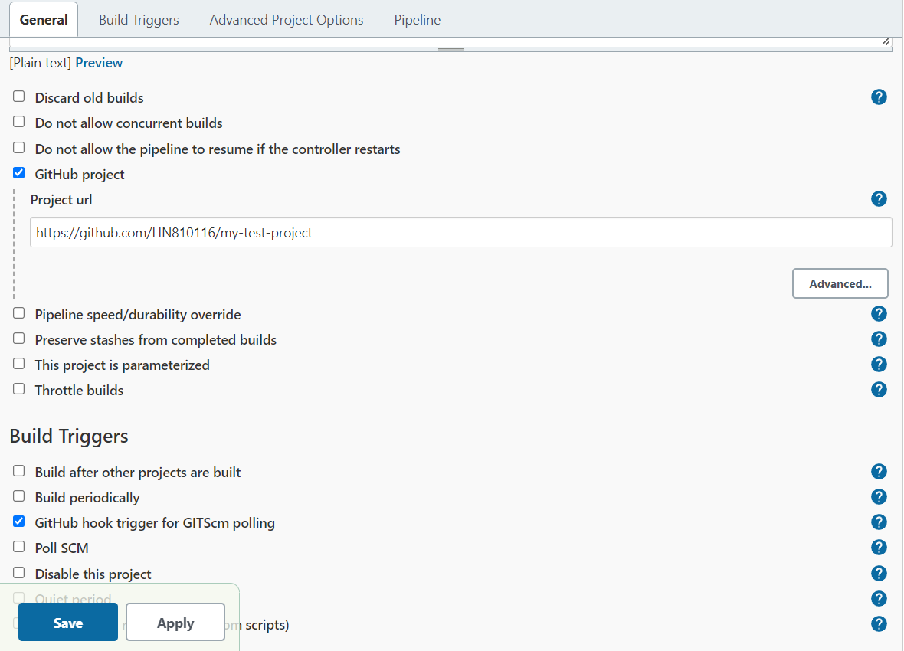

=================================================
Setting up Jenkins project with GitHub repository
=================================================

A template repository can be downloaded from :download:`here <./_static/template-project.zip>`

Adding SSH key for private repository
=====================================

#. Run ``ssh-keygen`` command to generate the ssh key pair.
#. Adding ssh public key to GitHub repository. See `the the Deploy keys setup instructions <https://docs.github.com/en/developers/overview/managing-deploy-keys#setup-2>`_ (you can skip the first step)
#. Adding ssh private key to Jenkins global credentials. See `Adding new global credentials <https://www.jenkins.io/doc/book/using/using-credentials/#adding-new-global-credentials>`_

Creating a Jenkins project
==========================

#. From the Jenkins Dashboard, click **New Item**

   .. figure:: ./_static/images/dashboard_new_item.PNG
      :align: center

      Dashboard - new item

#. Enter a name for the project (recommend using the same name as the GitHub repository), Select **pipeline**, Then click **OK**

   .. figure:: ./_static/images/create_pipeline.PNG
      :align: center

      Create pipeline

#. Select **GitHub project** and enter the GitHub project URL
#. Select **GitHub hook trigger for GITScm polling**
#. Save

Setting up CI/CD pipeline
=========================

#. From the Jenkins project page, click **Configure**

   .. figure:: ./_static/images/project_page.PNG
      :align: center

#. Scroll down to the Pipeline section
#. You can either provide a `Jenkinsfile <https://www.jenkins.io/doc/book/pipeline/jenkinsfile/>`_ or write a pipeline script directly in the **Script** box to set up the pipeline. See the `Declarative Pipeline fundamentals <https://www.jenkins.io/doc/book/pipeline/#declarative-pipeline-fundamentals>`_ for more details.

   Below is an example of a pipeline script which will clone a private GitHub repository, install Python dependencies from requirements.txt file, run python tests, build Sphinx documentation, and finally deploy the built Sphinx documentation to Github gh-pages branch.

   .. code-block::

        pipeline {
            agent any

            environment {
                REMOTE_URL = 'git@github.com:LIN810116/my-test-project.git'
                CREDENTIAL_ID = 'my-test-project'
                BRANCH = 'main'
                USER_NAME = 'clin864'
                USER_EMAIL = 'clin864@aucklanduni.ac.nz'
                TEST_MODULE = 'tests/test_main.py'
                SOURCE_DIR = './docs/source'
                BUILD_DIR = './docs/build'
            }

            stages {
                stage('Setup') {
                    steps{
                        echo "Cloning GitHub repository..."
                        git branch: "${BRANCH}", credentialsId: "${CREDENTIAL_ID}", url: "${REMOTE_URL}"
                        echo "Creating virtual environment"
                        sh '''
                            python --version
                            python -m venv venv
                        '''
                    }
                }

                stage('Install Dependencies') {
                    when {
                        expression { return fileExists ('requirements.txt') }
                    }
                    steps {
                        echo "Installing dependencies..."
                        sh '''
                            . venv/bin/activate
                            pip install --upgrade pip
                            pip install -r requirements.txt
                        '''
                    }
                }

                stage ('Test'){
                    when {
                        expression { return fileExists (TEST_MODULE) }
                    }
                    steps {
                        echo "Running tests"
                        sh '''
                            . venv/bin/activate
                            python -m unittest ${TEST_MODULE}
                        '''
                    }
                }

                stage('Build docs') {
                    steps {
                        echo "Building"
                        echo "${WORKSPACE}"
                        sh "${WORKSPACE}/venv/bin/sphinx-build -b html ${SOURCE_DIR} ${BUILD_DIR}"
                    }
                }

                stage("Deploy Docs") {
                    steps {
                        echo "Deploying to GitHub pages"
                        sh '''
                            git config --global user.email ${USER_EMAIL}
                            git config --global user.name ${USER_NAME}
                        '''

                        sh 'npm install -g --silent gh-pages@2.1.1'
                        sh 'touch ${BUILD_DIR}/.nojekyll'
                        sshagent(credentials: ["${CREDENTIAL_ID}"]) {
                            sh '''
                                gh-pages --dotfiles --message '[skip ci] Updates' --dist ${BUILD_DIR}
                            '''
                        }
                    }
                }

            }
        }

   Detailed explanations:

   #. Environment variables:

      * **REMOTE_URL**: github repository URL
      * **CREDENTIAL_ID**: only needed for private repository. use the credential you created in :ref:`Adding SSH key for private repository`
      * **BRANCH**: branch name
      * **USER_NAME**: Github username
      * **USER_EMAIL**: Github email
      * **TEST_MODULE**: path to the test module. see `this <https://docs.python.org/3/library/unittest.html#command-line-interface>`_ for more details about Python unittest
      * **SOURCE_DIR**: documentation source
      * **BUILD_DIR**: documentation build folder

   #. **stage('Setup')**: this pipeline stage will clone the GitHub repository and create a Python virtual environment
   #. **stage('Install Dependencies')**: install Python dependencies using requirements.txt if the requirements.txt file exists in the project root
   #. **stage ('Test')**: Run tests from test module
   #. **stage('Build docs')**: Build Sphinx documentation
   #. **stage("Deploy Docs")**: Deploy built documentation to the gh-pages branch. **gh-pages** is a special branch for hosting your static build on Github pages.

#. **Apply** then **Save**
#. Build can also be manually triggered by clicking **Build Now** from the Jenkins project page.

   .. figure:: ./_static/images/build_now.PNG
      :align: center

Adding webhook to GitHub repository
===================================

#. From the **Settings** page of your GitHub repository, click **Webhooks** from the left menu
#. In the **Payload URL** field, enter jenkins' host URL and port number followed by **/github-webhook/**. E.g. ``http://HOST_IP:8080/github-webhook/``
#. In **Content type**, choose application/json
#. In **Which events would you like to trigger this webhook?**, choose **Let me select individual events**, then select the events you want. E.g. select **Pull Requests** and **Pushes**
#. At the bottom of the page, make sure the **Active** option is selected
#. Click **Add webhook**
